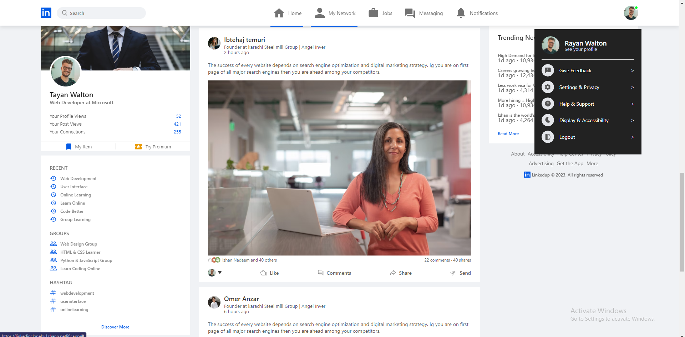
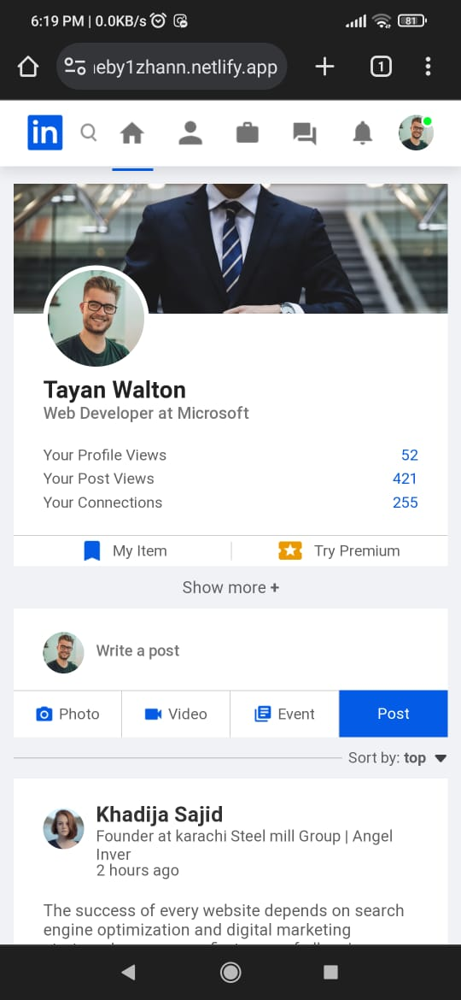

# LinkedIn Clone (Landing Page)

This is a complete responsive website clone of LinkedIn made using HTML, CSS, and JavaScript. It's a front-end website design project that replicates the appearance of the popular professional networking platform, LinkedIn.

## Live Demo

You can access the live version of this project [here](https://linkedincloneby1zhann.netlify.app/).

## Project Overview

This LinkedIn Clone project is created using HTML, CSS, and JavaScript. It mimics the appearance of LinkedIn, including:

### Home Page

- The home page provides a news feed where users can share posts and updates with their network.
- Users can interact with posts by liking, commenting, and sharing.
- The news feed displays posts.

### Profile Page

- The profile page allows users to create and customize their professional profiles.
- Users can add details such as their name, profile picture, work experience, education, skills, and more.
- This page serves as the user's personal space to showcase their professional achievements.

### Dropdown Menu

- Clicking on the profile picture at the top right corner of the page opens a dropdown menu.
- The dropdown menu provides options for user account management.
- It also includes a direct link to the user's profile page.

## Courtesy
<https://www.youtube.com/watch?v=0ihPVIrf_Dw&ab_channel=GreatStack>

